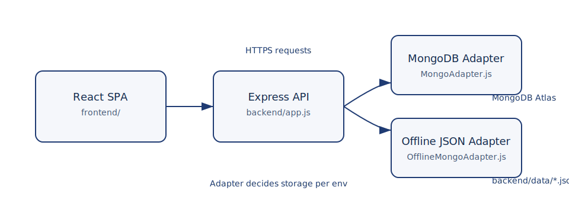

# Composition of Modules & Programs

This document explains how the Online Library Management System (OLMS) is assembled, how its major programs cooperate at runtime, and where to extend or integrate new functionality.

## System Overview



```
React SPA (frontend/) ──HTTPS──▶ Express API (backend/) ──Adapter──▶ MongoDB Atlas
                                         │                               ▲
                                         └─────────────Offline JSON──────┘
```

- The **frontend** is a React single-page application served separately (Vercel locally `npm run client:dev`).
- The **backend** is an Express API (`npm run server:dev`) exposing REST endpoints under `/api/*`.
- The **database adapter layer** decides whether to talk to MongoDB or local JSON files, allowing offline operation for development and demos.

## Runtime Programs

| Program | Location | Responsibility | Key Dependencies |
| --- | --- | --- | --- |
| Root Orchestrator | [package.json](../package.json) | Provides npm scripts such as `npm run dev`, `npm run dev:offline`, and `npm run keep-alive` to coordinate frontend + backend + tooling. | concurrently, rimraf |
| Backend Server | [backend/server.js](../backend/server.js) | Loads env vars, boots the Express app, connects the shared `DatabaseAdapter`, and keeps process signals tidy. | dotenv, adapters/DatabaseAdapter |
| Express App | [backend/app.js](../backend/app.js) | Constructs middleware stack, configures CORS, exposes `/uploads`, mounts every route module, and returns health probes. | express, cors, cookie-parser, routes/* |
| Frontend Entry | [frontend/src/index.js](../frontend/src/index.js) | Hydrates the React tree, wraps providers (Router, Auth, Settings), and renders `<App />`. | React 18, react-router-dom |
| React Router Shell | [frontend/src/App.js](../frontend/src/App.js) | Defines splash/loading UX, selects correct dashboard by role, and declares all protected routes inside the shared `Layout`. | AuthContext, ProtectedRoute, Material UI |

## Backend Composition

### Adapter Layer
- [adapters/DatabaseAdapter.js](../backend/adapters/DatabaseAdapter.js) exposes a single surface (`connect`, `initialize`, `getType`, CRUD helpers) that the rest of the API uses.
- [adapters/MongoAdapter.js](../backend/adapters/MongoAdapter.js) handles the live MongoDB connection, builds collections/models, and performs aggregation-heavy tasks.
- [adapters/OfflineMongoAdapter.js](../backend/adapters/OfflineMongoAdapter.js) persists JSON payloads inside [backend/data](../backend/data) and mirrors the Mongo API so features keep working without a database.
- The adapter instance is created once in `app.js` and reused inside `server.js` so the same connection serves every request.

### Middleware & Utilities
- [middleware/customAuth.js](../backend/middleware/customAuth.js) validates JWT cookies/headers, injects user claims, and guards protected routes.
- [utils](../backend/utils) contains cross-cutting helpers such as audit logging, notification channels, QR/transaction ID generators, and cached settings readers.
- Morgan logging, cookie-parser, and JSON parsers are added globally in [backend/app.js](../backend/app.js) for consistent observability and payload handling.

### Route Modules
Each route file exports its own `express.Router()` instance. They all receive `req.dbAdapter`, so they remain storage-agnostic.

| Route | Path Prefix | Purpose |
| --- | --- | --- |
| [routes/customAuth.js](../backend/routes/customAuth.js) | `/api/auth` | Login, refresh tokens, logout, and role checks. |
| [routes/users.js](../backend/routes/users.js) | `/api/users` | CRUD for staff, librarians, admins, plus profile updates. |
| [routes/students.js](../backend/routes/students.js) | `/api/students` | Student enrollment, CSV imports, and profile edits. |
| [routes/books.js](../backend/routes/books.js) | `/api/books` | Catalog metadata, copy tracking, and barcode helpers. |
| [routes/transactions.js](../backend/routes/transactions.js) | `/api/transactions` | Borrow/return flows, approvals, fines, and receipts. |
| [routes/reports.js](../backend/routes/reports.js) | `/api/reports` | Dashboard summaries, overdue listings, and export endpoints. |
| [routes/settings.js](../backend/routes/settings.js) | `/api/settings` | Library parameters, fine rules, school year data. |
| [routes/audit.js](../backend/routes/audit.js) | `/api/audit` | System audit trail queries and filters. |
| [routes/curriculum.js](../backend/routes/curriculum.js) | `/api/curriculum` | Department/curriculum lookup utilities. |
| [routes/annualSets.js](../backend/routes/annualSets.js) | `/api/annual-sets` | Textbook set definitions per academic year. |
| [routes/search.js](../backend/routes/search.js) | `/api/search` | Global search across books, users, and transactions. |
| [routes/notifications.js](../backend/routes/notifications.js) | `/api/notifications` | Event notifications, read-state tracking. |
| [routes/locations.js](../backend/routes/locations.js) | `/api/locations` | Branch and pickup/drop-off location data. |
| [routes/reports.js](../backend/routes/reports.js) | `/api/reports` | Aggregated analytics for dashboards. |

### Static Assets & Uploads
- [backend/uploads](../backend/uploads) stores avatars and generated documents. They are served read-only via `app.use('/uploads', express.static(...))`.

### Operational Scripts
- [scripts/reset-and-seed-mongo.js](../backend/scripts/reset-and-seed-mongo.js) wipes MongoDB collections and seeds canonical data.
- [scripts/migrate-offline-data-to-mongo.js](../backend/scripts/migrate-offline-data-to-mongo.js) imports JSON offline data into MongoDB Atlas.
- [scripts/cleanup-email-verification.js](../backend/scripts/cleanup-email-verification.js) and companions automate housekeeping.
- Root-level helpers such as [scripts/keep-alive.js](../scripts/keep-alive.js), [START_OLMS.bat](../START_OLMS.bat), and [debug-routes.js](../debug-routes.js) round out the operational tooling.

## Frontend Composition

### Application Shell
- [frontend/src/index.js](../frontend/src/index.js) wires React Router, `AuthContext`, `SettingsContext`, and MUI theme providers before rendering `<App />`.
- [frontend/src/App.js](../frontend/src/App.js) orchestrates the splash screen, loading overlays, and complete routing graph. It chooses the correct dashboard route according to `user.role` and wraps protected areas with `<ProtectedRoute>` plus the shared [Layout](../frontend/src/components/Layout).

### Contexts & State
- [contexts/AuthContext.js](../frontend/src/contexts/AuthContext.js) stores the authenticated user, JWT tokens/cookies, and exposes helpers such as `login`, `logout`, and `hasRole`.
- [contexts/SettingsContext.js](../frontend/src/contexts/SettingsContext.js) caches system configuration fetched from `/api/settings` and keeps the UI synced with backend rules.

### Layout & Global Components
- [components/Layout](../frontend/src/components/Layout) provides navigation (sidebar, topbar), breadcrumbs, and responsive breakpoints for both desktop and tablet form factors.
- Shared widgets such as [components/Loading.js](../frontend/src/components/Loading.js), [components/SplashScreen.js](../frontend/src/components/SplashScreen.js), and [components/MobileScanDialog.js](../frontend/src/components/MobileScanDialog.js) deliver consistent UX for progress states, onboarding, and QR/Barcode scanning.

### Feature Pages
The `pages/` directory mirrors backend domains so every REST resource has a dedicated UI surface:

| Domain | Key Pages | Notes |
| --- | --- | --- |
| Authentication | [pages/Auth/LoginPage.js](../frontend/src/pages/Auth/LoginPage.js) | Handles credential input, error messaging, and redirects when `user` already exists. |
| Dashboards | Admin/Librarian/Staff/Student variants under [pages/Dashboard](../frontend/src/pages/Dashboard) | Each dashboard pulls tailored KPIs (requests, fines, borrow stats) via React Query hooks. |
| Users & Students | [pages/Users](../frontend/src/pages/Users) and [pages/Students](../frontend/src/pages/Students) | Provide list/detail/edit flows, CSV import surfaces, and profile views. |
| Books | [pages/Books](../frontend/src/pages/Books) | Catalog tables, detailed copy views, and creation/edit forms. |
| Transactions | [pages/Transactions](../frontend/src/pages/Transactions) | Borrow, approve/reject, return, annual textbook handling, and transaction receipts. |
| Reports & Audits | [pages/Reports](../frontend/src/pages/Reports) | Visualizations and audit log viewers leveraging Recharts & tables. |
| Notifications | [pages/Notifications/NotificationsPage.js](../frontend/src/pages/Notifications/NotificationsPage.js) | Surfaces notification feeds with read/unread controls. |
| Settings | [pages/Settings/SettingsPage.js](../frontend/src/pages/Settings/SettingsPage.js) | Exposes rule editors (fine policies, receipt templates, school year config). |
| Error States | [pages/Error](../frontend/src/pages/Error) | `NotFound`, `Unauthorized`, and fallback boundaries. |

### Utilities & Themeing
- [frontend/src/theme/customTheme.js](../frontend/src/theme/customTheme.js) centralizes typography, palette, and overrides for Material UI components.
- [frontend/src/utils](../frontend/src/utils) houses helpers for API accessors, QR scanning, table filters, and data parsers.
- Static data such as address lists lives in [frontend/src/data](../frontend/src/data).

## Data & Configuration Programs

- Environment variables are documented in [README.md](../README.md) and loaded via `.env` files (`backend/.env`, `frontend/.env`).
- JSON fixtures under [backend/data](../backend/data) drive offline mode and can be regenerated via helper scripts.
- Deployment descriptors ([render.yaml](../render.yaml), [vercel.json](../vercel.json)) encode how each platform builds the correct sub-project.

## Request Flow Walkthrough

1. The user signs in on the React SPA. `AuthContext` stores the session and `<ProtectedRoute>` gates the relevant dashboard.
2. UI components call `fetch`/`axios` helpers that hit `/api/*` endpoints defined in [frontend/src/utils](../frontend/src/utils).
3. Express middleware in [backend/app.js](../backend/app.js) authenticates the request via cookies/JWT headers and attaches `req.user` and `req.dbAdapter`.
4. The selected route handler performs validation, delegates business logic to services/utils, and persists data through the adapter interface.
5. Responses propagate back to the SPA, where React Query/contexts update caches and re-render dashboards, tables, or charts.
6. Audit logs, notifications, and background jobs enqueue via helpers in [backend/utils](../backend/utils) so secondary modules stay informed.

## Extending the System

1. **Back-end first**: create/extend a route in [backend/routes](../backend/routes), add validation/middleware, and rely on the adapter for persistence.
2. **Front-end alignment**: add API helpers, create or update React Query hooks, and surface UI in the matching domain directory inside [frontend/src/pages](../frontend/src/pages).
3. **Scripts & automation**: if the feature requires data seeding or batch jobs, leverage [backend/scripts](../backend/scripts) or add new CLI utilities alongside them.
4. **Configuration**: document new environment variables inside [README.md](../README.md) and ensure `render.yaml`/`vercel.json` include them for deployments.

Following this composition guide ensures every new module sits next to its backend counterpart, benefits from the adapter abstraction, and remains consistent with OLMS conventions.
